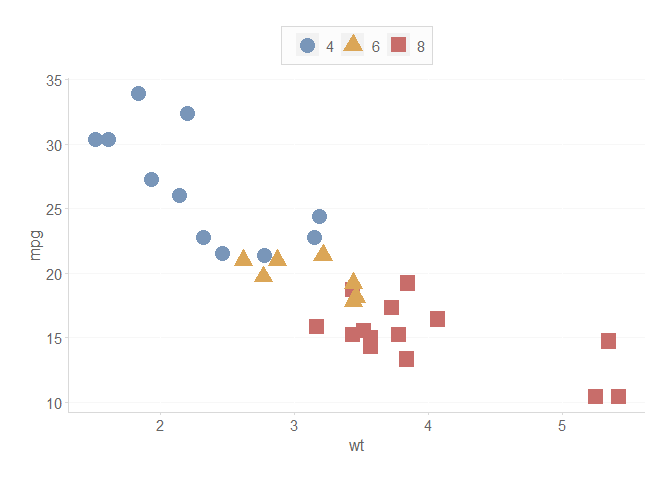
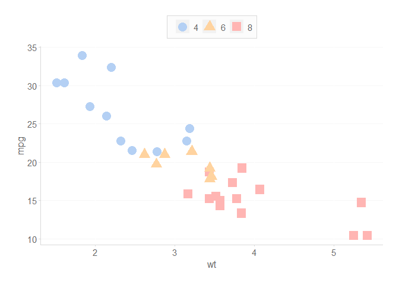
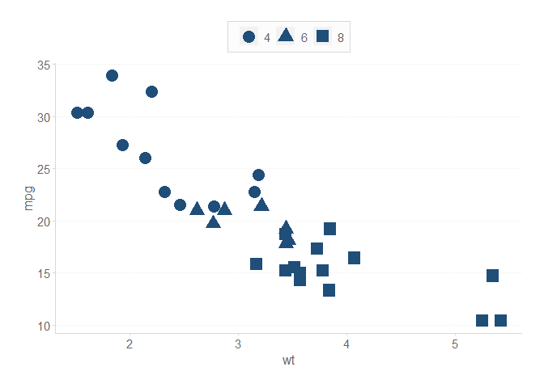
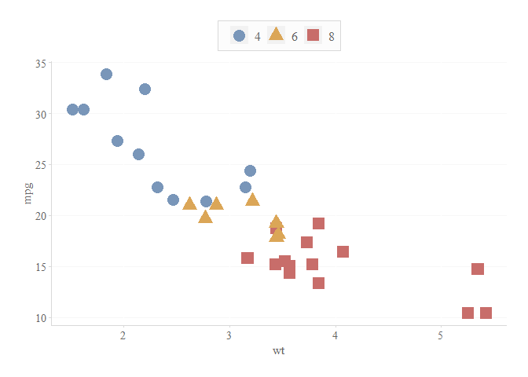
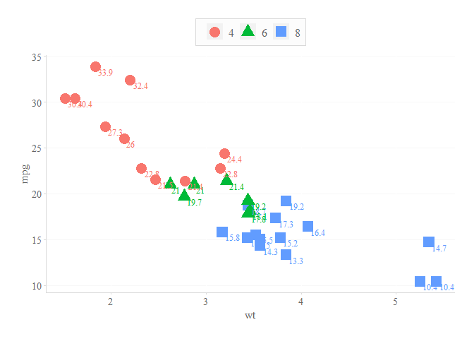
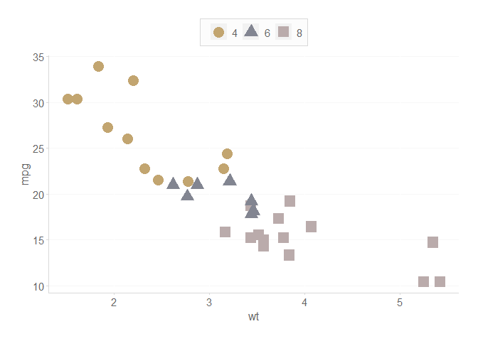
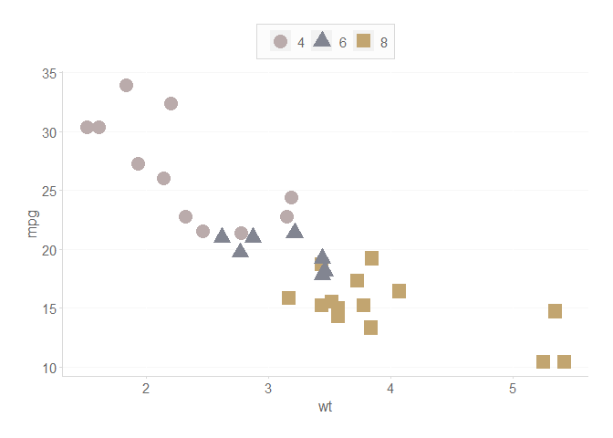
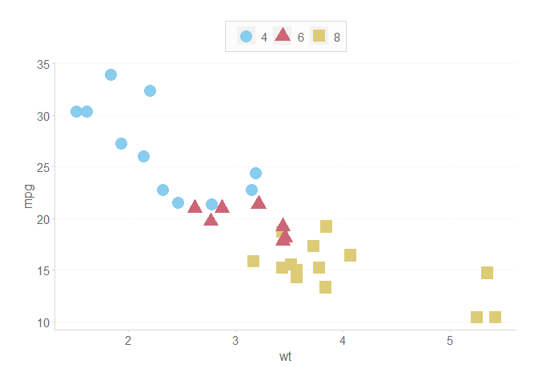

# CMAC Brand in ggplot2 - Installation and Examples
Daniel Carpenter

- [<span class="toc-section-number">1</span>
  `styles.cmac`](#styles.cmac)
  - [<span class="toc-section-number">1.1</span> Overview](#overview)
  - [<span class="toc-section-number">1.2</span> Installation of
    Package](#installation-of-package)
  - [<span class="toc-section-number">1.3</span> Viewing the
    Vignette](#viewing-the-vignette)
  - [<span class="toc-section-number">1.4</span> Examples](#examples)
    - [<span class="toc-section-number">1.4.1</span> Create a basic plot
      structure](#create-a-basic-plot-structure)
    - [<span class="toc-section-number">1.4.2</span> Use Multiple
      Colors](#use-multiple-colors)
    - [<span class="toc-section-number">1.4.3</span> Use only `1`
      Color](#use-only-1-color)
    - [<span class="toc-section-number">1.4.4</span> How to use Times
      New Roman](#how-to-use-times-new-roman)
    - [<span class="toc-section-number">1.4.5</span> Darken Text when
      Over Filled Elements](#darken-text-when-over-filled-elements)
    - [<span class="toc-section-number">1.4.6</span> Offset or Reverse
      Order of Colors](#offset-or-reverse-order-of-colors)
    - [<span class="toc-section-number">1.4.7</span> Override the
      palette with a color blind
      palette](#override-the-palette-with-a-color-blind-palette)
  - [<span class="toc-section-number">1.5</span> Numeric
    Formats](#numeric-formats)
  - [<span class="toc-section-number">1.6</span> Colors Deep
    Dive](#colors-deep-dive)
    - [<span class="toc-section-number">1.6.1</span> What Colors are
      Available?](#what-colors-are-available)
    - [<span class="toc-section-number">1.6.2</span> How to get `1`
      color?](#how-to-get-1-color)
    - [<span class="toc-section-number">1.6.3</span> How to get `>1`
      colors](#how-to-get-1-colors)

# `styles.cmac`

<!-- badges: start -->
<!-- badges: end -->

## Overview

> - CMAC Brand in `ggplot2`
> - Package that streamlines color palette usage, initially adapted from
>   the [Tableau 10
>   Palette](https://www.tableau.com/blog/colors-upgrade-tableau-10-56782)
> - See colorblind statistics for the [fill
>   palette](https://davidmathlogic.com/colorblind/#%23C0D0E4-%23FFD29A-%23FFB5B3-%23B9DDCF-%23CBC5EA-%23F2D4A0-%23DDC9CB-%23CCCED6)
>   and the [color (*line*)
>   palette](https://davidmathlogic.com/colorblind/#%238797AB-%23D6A55C-%23C3726F-%2387AB9D-%238D87AB-%23C2A570-%23A38F91-%23828591)
> - ***PLEASE SEE THE PACKAGE <u>VIGNETTE</u> FOR MORE DETAILED
>   EXAMPLES***

<br>

## Installation of Package

You can install the development version of styles.cmac from
[GitHub](https://github.com/) with:

``` r
# Install devtools if not installed (for GitHub Package)
if (!require("devtools")) install.packages("devtools")

devtools::install_github("CN-CMAC/styles.cmac", build_vignettes = TRUE)
```

## Viewing the Vignette

To see in-depth documentation of the package, please uncomment and issue
the following commands.

``` r
# See what vignettes are available
browseVignettes('styles.cmac')
```

## Examples

``` r
library(styles.cmac)
```

### Create a basic plot structure

> Plot that does *NOT* include CMAC Styles

``` r
library(ggplot2)

basePlot <- ggplot(data = mtcars,
               aes(x     = wt,
                   shape = as.factor(cyl),
                   color = as.factor(cyl),
                   y     = mpg
                   )
               ) +
          geom_point(size = 5)
basePlot # Display
```


### Use Multiple Colors

#### Default Color Palette

> Using CMAC Style

``` r
basePlot +
  
  # Use the CMAC color palette
  scale_color_cmac() +
  
  # Get the CMAC ggplot theme
  theme_cmac()
```



#### Override Color with Fill

> Using CMAC Style

``` r
basePlot +
  
  # Use the CMAC Fill palette (override)
  scale_color_cmac(overrideWithFill = TRUE) +  
  
  # Get the CMAC ggplot theme
  theme_cmac()
```



### Use only `1` Color

> Using CMAC Style

``` r
basePlot + 
  
  # Use only a single color (note using line palette)
  geom_point(color = scale_cmac('blue', 'blue2'),
             size  = 5) +
  
  # Get the CMAC ggplot theme
  theme_cmac()
```



### How to use Times New Roman

> Use this setting for ***non-website*** reporting.

#### Non-Label Font Control

``` r
basePlot +
  
  # Use the CMAC color palette
  scale_color_cmac() +
  
  # Get the CMAC ggplot theme
  theme_cmac(inTimesNewRoman = TRUE)
```



#### Label Font Control

``` r
basePlot + 
  
  geom_text(aes(label = paste(mpg)),
            vjust = 1.2, hjust = -0.2,
            size = 3.5,
            
            # ** IMPORTANT: theme() does not control text labels
            # Need to set family to this font!
            family = styles.cmac::getTimesNewRomanFamily()
            ) + 
  
  # This controls all non-label fonts
  theme_cmac(inTimesNewRoman = TRUE)
```



### Darken Text when Over Filled Elements

``` r
ggplot(mtcars, aes(y = mpg, x = wt, color = as.factor(cyl))) +
  geom_point(aes(fill = as.factor(cyl)),
             size = 10,
             pch = 21,
             color = 'transparent',
             alpha = 0.9
  ) +
  geom_text(aes(label = round(mpg, 0))) +
  scale_fill_cmac() +

  # KEY - darken the text so that it is easier to view
  # Over fill
  scale_color_cmac(darkenPaletteForTextGeoms = TRUE) +
  theme_cmac()
```


### Offset or Reverse Order of Colors

``` r
# Offset the colors by 1
basePlot + scale_color_cmac(colorOffset = 5)
```



``` r
# reverse the order of the palette
basePlot + scale_color_cmac(reverseOrder = TRUE)
```



### Override the palette with a color blind palette

``` r
# Use color blind friendly palette (works with fill too)
basePlot + scale_color_cmac(useColorBlindPalette = TRUE)
```



``` r
# Change the palette (can use cols4all::c4a_palettes() to try others)
# Also, can demo others in GUI using cols4all::c4a()
basePlot + scale_color_cmac(useColorBlindPalette = TRUE, 
                            colorBlindPaletteName = 'color_blind')
```


## Numeric Formats

> Mainly for quick financial axis formatting

``` r
kDollarsFormat(1000,          scaleUnit = 'K')
```

    [1] "$1 K"

``` r
kDollarsFormat(1000000,       scaleUnit = 'M')
```

    [1] "$1 M"

``` r
kDollarsFormat(1000000,       scaleUnit = 'MM')
```

    Warning in kDollarsFormat(1e+06, scaleUnit = "MM"): Scale format given (MM) not
    in list: K, M, B, T. Using "M" as default.

    [1] "$1 M"

``` r
kDollarsFormat(1000000000,    scaleUnit = 'B')
```

    [1] "$1 B"

``` r
kDollarsFormat(1500000000000, scaleUnit = 'T')
```

    [1] "$1.50 T"

``` r
kDollarsFormat(1000000,       scaleUnit = 'M', useDollarSign = FALSE)
```

    [1] "1 M"

## Colors Deep Dive

### What Colors are Available?

- Notice `displayNames = TRUE`, which show you what hex codes are
  associated with the color names.

- Default is `displayNames = FALSE` for best functionality with plotting

#### Fill colors

``` r
scale_cmac('fill', displayNames = TRUE)
```

         blue    orange       red     green    purple    yellow      gray   purple1 
    "#B4D0F4" "#FFD39F" "#FFB5B3" "#B4DFCE" "#CDC9E0" "#F2D4A0" "#C3C6D2" "#E6D7D7" 

#### Accent colors

``` r
scale_cmac('color', displayNames = TRUE)
```

         blue    orange       red     green    purple    yellow      gray   purple1 
    "#7996b9" "#dba657" "#c86d6a" "#83af9e" "#928ea4" "#c2a570" "#828591" "#baabab" 

#### Blue and Gray colors, like the background of slide decks

``` r
scale_cmac('blue', displayNames = TRUE)
```

        blue1     blue2     blue3     blue4 
    "#183C5C" "#1F4E79" "#91AACB" "#BECDE0" 

``` r
scale_cmac('gray', displayNames = TRUE)
```

        white    gray10     gray9     gray8     gray7     gray6     gray5     gray4 
    "#FFFFFF" "#FAFAFA" "#F1F1F1" "#EAEAEA" "#D9D9D9" "#CFCECE" "#A6A6A6" "#646464" 
        gray3     gray2     gray1 
    "#444444" "#363636" "#222222" 

#### Text, Grays, and Blues

- Common colors that you might need

``` r
scale_cmac('text') # Text (dark gray) 
```

    [1] "#646464"

``` r
scale_cmac('blue') # Grays that are in the brand
```

    [1] "#183C5C" "#1F4E79" "#91AACB" "#BECDE0"

``` r
scale_cmac('gray') # Blues that are in the brand
```

     [1] "#FFFFFF" "#FAFAFA" "#F1F1F1" "#EAEAEA" "#D9D9D9" "#CFCECE" "#A6A6A6"
     [8] "#646464" "#444444" "#363636" "#222222"

### How to get `1` color?

``` r
# Single color from the fill palette
scale_cmac('fill', 'red')
```

    [1] "#FFB5B3"

``` r
# Single color from the base palette
scale_cmac('gray', 'gray3')
```

    [1] "#444444"

``` r
# Single color from the base palette
scale_cmac('blue', 'blue2')
```

    [1] "#1F4E79"

### How to get `>1` colors

``` r
# Get the first 3 colors in the line palette
scale_cmac('color', 3)
```

    [1] "#7996b9" "#dba657" "#c86d6a"

``` r
# Get the last 3 colors in the fill palette
scale_cmac('color')[6:8]
```

    [1] "#c2a570" "#828591" "#baabab"

``` r
# Or access specific colors all at once
scale_cmac('color', 'blue', 'orange', 'green', 'yellow')
```

    [1] "#7996b9" "#dba657" "#83af9e" "#c2a570"
